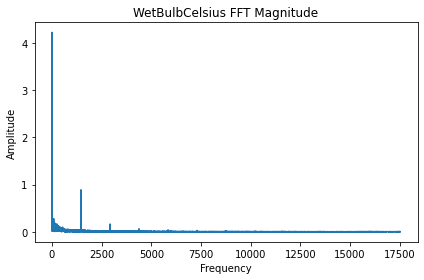
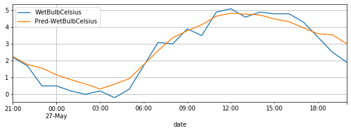

===========
Get Started
===========

.. _Install PaddleTS:
.. _安装PaddleTS:

1. Install PaddleTS
----------------------

| PaddleTS is built upon `PaddlePaddle <https://www.paddlepaddle.org.cn/>`__
  and the minimum version required is 2.3. Please refer to 
  `the official guide <https://www.paddlepaddle.org.cn/install/quick?docurl=/documentation/docs/zh/install/compile/linux-compile.html>`__
  for installing ``PaddlePaddle``. If you have ``PaddlePaddle`` installed already, please skip this step.
| Next, install ``PaddleTS`` with pip command:

::

   pip install paddlets

Besides, we can install ``PaddlePaddle`` and ``PaddleTS`` at the same
time with pip command:

::

   pip install paddlets[all]

Once installed successfully, you can import PaddleTS in your code:

.. code:: python

   import paddlets
   print(paddlets.__version__)

::

   #0.2.0

.. _Build TSDataset:
.. _构建TSDataset:

2. Build TSDataset
---------------------

``TSDataset`` is one of the fundamental classes in ``PaddleTS``, which 
is designed as the first-class citizen in the library to represent the
time series data and is widely used by other modules. Currently, it
supports the representation of :

1. Univariate time series w/wo covariates
2. Multivariate time series w/wo covariates

| ``TSDataset`` needs a proper time index which can either be of type
  ``pandas.DatetimeIndex`` or of type ``pandas.RangeIndex`` (representing
  sequential data without specific timestamps).

2.1. Built-in TSDataset
~~~~~~~~~~~~~~~~~~~~~~~

PaddleTS comes with a set of publicly available time series datasets, which can be easily accessed as TSDataset objects.

.. code:: python

   from paddlets.datasets.repository import get_dataset, dataset_list
   print(f"built-in datasets: {dataset_list()}")

::

   #built-in datasets: ['UNI_WTH', 'ETTh1', 'ETTm1', 'ECL', 'WTH']

Simply call ``get_dataset`` to access a built-in dataset, which will return a TSDataset object built from the dataset.
The ``UNI_WTH`` dataset is a univariate dataset containing weather from 2010 to 2014, where ``WetBulbCelsuis`` represents the wet bulb temperature.

.. code:: python

   dataset = get_dataset('UNI_WTH')
   print(type(dataset))

::

   #<class 'paddlets.datasets.tsdataset.TSDataset'>

.. code:: python

   dataset.plot()

--------------

|UNI_WTH|

2.2. Customized TSDataset
~~~~~~~~~~~~~~~~~~~~~~~~~

One can also build a TSDataset from a ``pandas.DataFrame`` or a CSV file.

.. code:: python

   import pandas as pd
   import numpy as np
   from paddlets import TSDataset

   x = np.linspace(-np.pi, np.pi, 200)
   sinx = np.sin(x) * 4 + np.random.randn(200)
   
   df = pd.DataFrame(
       {
           'time_col': pd.date_range('2022-01-01', periods=200, freq='1h'), 
           'value': sinx
       }
   )
   custom_dataset = TSDataset.load_from_dataframe(
       df,  #Also can be path to the CSV file
       time_col='time_col', 
       target_cols='value', 
       freq='1h'
   )
   custom_dataset.plot()

--------------

|CUS_DATASET_2|

| To learn more about the ``TSDataset``, refer to `Dataset <../modules/datasets/overview.html>`_

.. _Exploring Data:
.. _数据查看与分析:

3. Explore Data
-------------------

To get a brief overview, simply call ``TSDataset.summary``.

::

   dataset.summary()

--------------

| |SUMMARY| 

| From the above output, we can have a broad picture about the dataset. Particularly, when the ``missing`` is not zero, it's usually necessary to fill the missing values before feeding the dataset to a model.
| We can also do some advanced analysis about the dataset with the functionalities from the analysis module. For example, we can perform ``FFT`` on a column of the dataset as shown below.

.. code:: python

   #FFT 
   from paddlets.analysis import FFT
   fft = FFT()
   res = fft(dataset, columns='WetBulbCelsius')
   fft.plot()

--------------

| |FFT|

| To learn more about the ``FFT``, refer to `Analysis <../modules/analysis/overview.html>`_

.. _Training Model and Making Forecasting:
.. _模型训练及预测:

4. Train Model and Make Forecasting
----------------------------------------

This section shows how to train a deep neural network model for time series forecasting and how to make forecasting using the trained model.

4.1. Create the training, validation, and testing datasets
~~~~~~~~~~~~~~~~~~~~~~~~~~~~~~~~~~~~~~~~~~~~~~~~~~~~~~~~~~

.. code:: python

   train_dataset, val_test_dataset = dataset.split(0.7)
   val_dataset, test_dataset = val_test_dataset.split(0.5)
   train_dataset.plot(add_data=[val_dataset,test_dataset], labels=['Val', 'Test'])

--------------

|T_V_T|

4.2. Train the model
~~~~~~~~~~~~~~~~~~~~~

| We will use the built-in ``MLPRegressor`` model as an example to show how to train model.
| Initialize a MLPRegressor instance with two required parameters: 

1. ``in_chunk_len``: the size of loopback window, i.e. the number of time steps feed to the model
2. ``out_chunk_len``: the size of forecasting horizon, i..e. the number of time steps output by the model

| There are also optional parameters when initializing the ``MLPRegressor`` instance., such as ``max_epochs``, ``optimizer_params``, etc.

.. code:: python

   from paddlets.models.forecasting import MLPRegressor
   mlp = MLPRegressor(
       in_chunk_len = 7 * 24,
       out_chunk_len = 24,
       max_epochs=100
   )

Now, we can train the model with ``train_dataset`` and optional ``val_dataset``.

.. code:: python

   mlp.fit(train_dataset, val_dataset)

| To learn more about the ``MLPRegressor``, refer to `Models <../modules/models/overview.html>`_

4.3. Make Forecasting
~~~~~~~~~~~~~~~~~~~~~

Next we can make forecasting using the trained model, and the length of predicted results is equal to ``out_chunk_len``.

.. code:: python

   subset_test_pred_dataset = mlp.predict(val_dataset)
   subset_test_pred_dataset.plot()

--------------

|PRED_SUBSET| 

Plot the predicted results and ground-truth values for comparison.

.. code:: python

   subset_test_dataset, _ = test_dataset.split(len(subset_test_pred_dataset.target))
   subset_test_dataset.plot(add_data=subset_test_pred_dataset, labels=['Pred'])

--------------

|PRED_TRUE_SUBSET| 

Consider the case where the expected prediction length is longer than the forecasting horizong of the fitted model (i.e. out_chunk_len), we can call ``recursive_predict`` to fulfill this task.
As an example, given the previously loaded ``UNI_WTH`` dataset, suppose we want to forecast the ``WetBulbCelsuis`` of the future 96 hours, 
while the forecasting horizong of the fitted model is set to 24 hours. The following code example illustrates the usage of ``recurive_predict`` regarding this case:

.. code:: python

   subset_test_pred_dataset = mlp.recursive_predict(val_dataset, 24 * 4)
   subset_test_dataset, _ = test_dataset.split(len(subset_test_pred_dataset.target))
   subset_test_dataset.plot(add_data=subset_test_pred_dataset, labels=['Pred'])

--------------

|LONG_PRED_TRUE_SUBSET| 

.. _Evaluation and Backtest:
.. _评估和回测:

5. Evaluation and Backtest
--------------------------

In addition to visually compare the predicted results and the ground-truth values, we can also evaluate the performance of the model by computing some built-in metrics.

.. code:: python

   from paddlets.metrics import MAE
   mae = MAE()
   mae(subset_test_dataset, subset_test_pred_dataset)

::

   #{'WetBulbCelsius': 0.6734366664042076}

We can also evaluate the performance of the model on the whole test dataset by calling ``backtest``.

.. code:: python

   from paddlets.utils import backtest
   metrics_score = backtest(
       data=val_test_dataset, 
       model=mlp, 
       start=0.5, 
       predict_window=24, 
       stride=24, 
       metric=mae
   )
   print(f"mae: {metrics_score}")

::

   #mae: 1.3767653357878213

| To learn more about the ``backtest``, refer to `backtest <../modules/backtest/overview.html>`_

.. _Covariates:
.. _协变量:

6. Covariates
-------------------

| In addition to the univariate or multivariate target time series, ``PaddleTS`` also allows user to supply more contextual information in the form of covariates.
| Covariates can be one of the following 3 types:

1. ``known_covariate`` Variables which can be forecasted for future time
   steps, e.g. weather forecasts
2. ``observed_covariate`` Variable which can only be observed in
   historical data, e.g. measured temperatures
3. ``static_covariate`` Constant variables

6.1. Generate Date-Related Covariates
~~~~~~~~~~~~~~~~~~~~~~~~~~~~~~~~~~~~~~~

We use ``TimeFeatureGenerator`` in ``paddlets.transform`` to generate
``known covariates`` about date and time:

.. code:: python

   from paddlets.transform import TimeFeatureGenerator
   time_feature_generator = TimeFeatureGenerator(feature_cols=['dayofyear', 'weekofyear', 'is_workday'])
   dataset_gen_target_cov = time_feature_generator.fit_transform(dataset)
   print(dataset_gen_target_cov)
   print(dataset_gen_target_cov.known_cov)

--------------

|COV_PD|

6.2. Customized Covariates
~~~~~~~~~~~~~~~~~~~~~~~~~~

We can also build a ``TSDataset`` with only covariates from a ``pandas.DataFrame`` or a CSV file.

.. code:: python

   import pandas as pd
   from paddlets import TSDataset
   df = pd.DataFrame(
       {
           'time_col': pd.date_range(
               dataset.target.time_index[0], 
               periods=len(dataset.target), 
               freq=dataset.freq
           ), 
           'cov1': [i for i in range(len(dataset.target))]
       }
   )
   dataset_cus_cov = TSDataset.load_from_dataframe(
       df, 
       time_col='time_col', 
       known_cov_cols='cov1', 
       freq=dataset.freq
   )
   print(dataset_cus_cov)

--------------

|COV| 

Then we can concatenate this TSDataset with an existing ``TSDataset`` to produce a new ``TSDataset`` with both the target and covariate time series.

.. code:: python

   dataset_cus_target_cov = TSDataset.concat([dataset, dataset_cus_cov])
   print(dataset_cus_target_cov)

--------------

|COVTARGET|

.. _Training Model with Covariates:
.. _基于包含协变量数据的模型训练:

7. Train Model with Covariates
---------------------------------

Take ``RNNBlockRegressor`` as an example to show how to build a
model using ``TSDataset`` with covariates.

.. code:: python

   from paddlets.models.forecasting import RNNBlockRegressor
   rnn_reg = RNNBlockRegressor(
       in_chunk_len = 7 * 24,
       out_chunk_len = 24,
       skip_chunk_len = 0,
       sampling_stride = 24,
       max_epochs = 100
   )

Create the training, validation and testing dataset:

.. code:: python

   train_dataset, val_test_dataset = dataset_gen_target_cov.split(0.8)
   val_dataset, test_dataset = val_test_dataset.split(0.5)

Normalize the dataset by ``StandardScaler`` from ``paddlets.transform``:

.. code:: python

   from paddlets.transform import StandardScaler
   scaler = StandardScaler()
   scaler.fit(train_dataset)
   train_dataset_scaled = scaler.transform(train_dataset)
   val_test_dataset_scaled = scaler.transform(val_test_dataset)
   val_dataset_scaled = scaler.transform(val_dataset)
   test_dataset_scaled = scaler.transform(test_dataset)

Now, we can fit the model and evaluate the performance:

.. code:: python

   rnn_reg.fit(train_dataset_scaled, val_dataset_scaled)

.. code:: python

   from paddlets.utils import backtest
   metrics_score = backtest(
       data=val_test_dataset_scaled, 
       model=rnn_reg, 
       start=0.5, 
       predict_window=24, 
       stride=24, 
       metric=mae
   )
   print(f"mae: {metrics_score}")

::

   #mae: 0.3021404146482557

.. _Pipeline:

8. Pipeline
-----------

Let’s wrap up everything from the previous sections into a pipeline to create an end-to-end solution.

.. code:: python

   from paddlets.pipeline import Pipeline

.. code:: python

   train_dataset, val_test_dataset = dataset.split(0.8)
   val_dataset, test_dataset = val_test_dataset.split(0.5)

Here we initialize a Pipeline instance to accommodate the date-related covariate generation, data normalization, and model training.

.. code:: python

   pipe = Pipeline([
       (TimeFeatureGenerator, {"feature_cols": ['dayofyear', 'weekofyear', 'is_workday'], "extend_points": 24}),
       (StandardScaler, {}),
       (RNNBlockRegressor, {
           "in_chunk_len": 7 * 24,
           "out_chunk_len": 24,
           "skip_chunk_len": 0,
           "sampling_stride": 24,
           "max_epochs": 100
       })
   ])

Next, we can fit the pipeline and evaluate the performance:

.. code:: python

   pipe.fit(train_dataset, val_dataset)

.. code:: python

   from paddlets.utils import backtest
   metrics_score = backtest(
       data=val_test_dataset, 
       model=pipe, 
       start=0.5, 
       predict_window=24, 
       stride=24, 
       metric=mae
   )
   print(f"mae: {metrics_score}")

::

   #mae: 4.992150762390378

| To learn more about the ``Pipeline``, refer to `Pipeline <../modules/pipeline/overview.html>`__

9. AutoTS
-----------
AutoTS is an automated machine learning tool for PaddleTS.

It frees the user from selecting hyperparameters for PaddleTS models or PaddleTS pipelines.

.. code:: python

    from paddlets.automl.autots import AutoTS
    from paddlets.models.forecasting import MLPRegressor
    from paddlets.datasets.repository import get_dataset
    tsdataset = get_dataset("UNI_WTH")

Here we initialize an `AutoTS` model with `MLPRegressor`, while its in_chunk_len is 96 and out_chunk_len is 2.

.. code:: python

    autots_model = AutoTS(MLPRegressor, 96, 2)

Next, we can train the AutoTS model and use it to make predictions, just like a PaddleTS model.

AutoTS has a built-in recommended search space for the PaddleTS models, so this MLPRegressor performs hyperparameter
optimization in the default built-in search space and uses the best parameters found during the optimization process to
fit the MLPRegressor.

.. code:: python

    autots_model.fit(tsdataset)
    predicted_tsdataset = autots_model.predict(tsdataset)

AutoTS also allows us to obtain the best parameters found during the optimization process.

.. code:: python

    best_param = autots_model.best_param

| To learn more about the ``AutoTS``, refer to `AutoTS <../modules/autots/overview.html>`__

