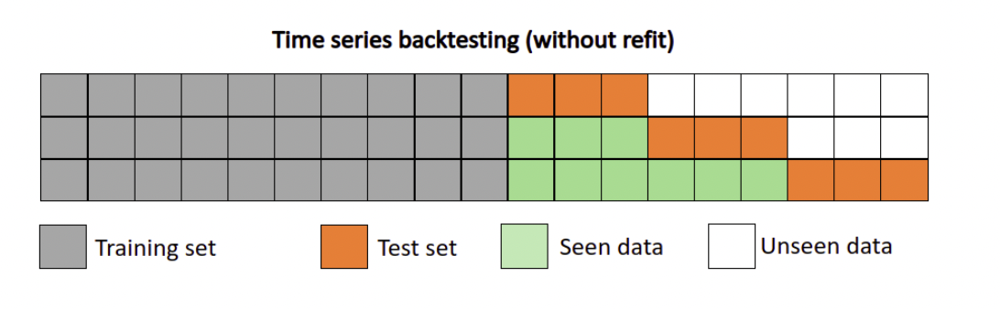
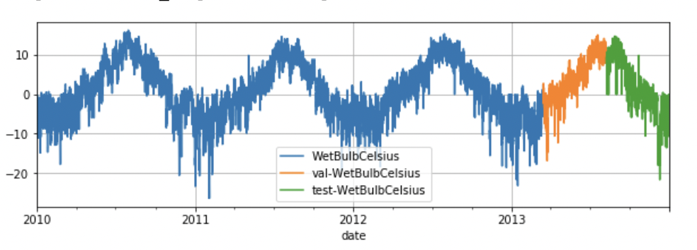
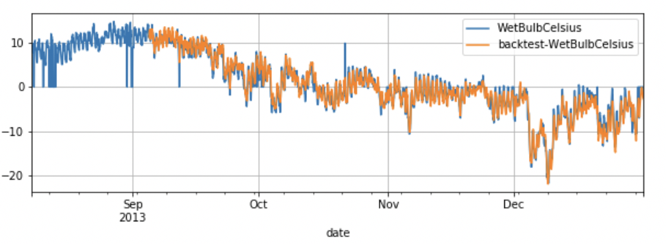
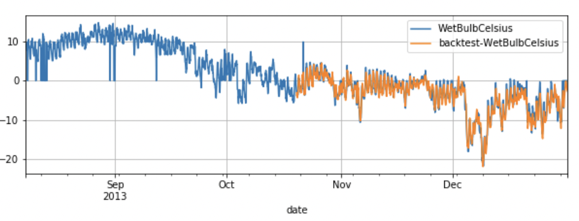
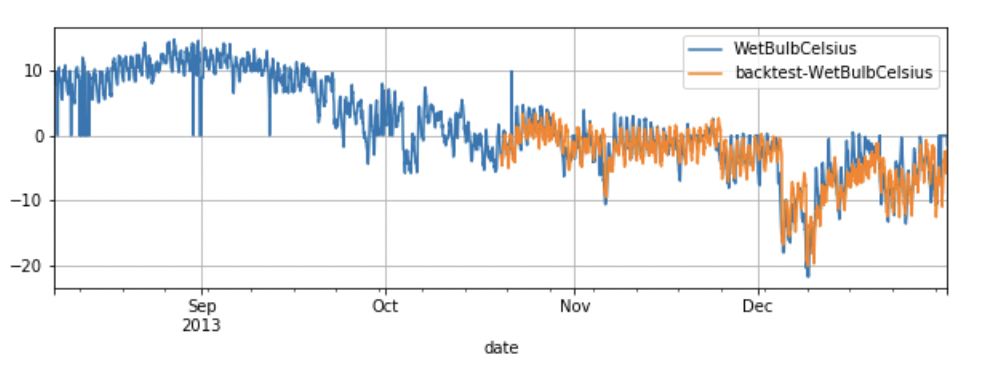

===================
Backtesting
===================

Backtesting simulates predictions that would have been obtained historically with a given model.
Backtesting is used to predict the future accuracy of a forecasting method, and is therefore 
useful in determining which model can be considered the most accurate .

--------------

|fig_1| 

Backtest is an iterative procedure,backtest repeatly predict on dataset with a fixed predict window, and then moves to the end of the
training set forward by fixed steps.  As in above figure, the orange part is a predict window with length 3. In each new iteration, the window
will move forward by 3 points, and the train set length will forward 3 points either. This procedure repeats util moves to the end of the training set.

Example
-------------------

1）Prepare Dataset

.. code:: python

    from paddlets.datasets.repository import get_dataset
    dataset = get_dataset('WTH')
    train_dataset, val_test_dataset = dataset.split(0.8)
    val_dataset, test_dataset = val_test_dataset.split(0.5)
    train_dataset.plot(add_data=[val_dataset,test_dataset],labels=["val","test"])

--------------

|fig_2| 

2）Fit model

.. code:: python

    from paddlets.models.forecasting import MLPRegressor
    mlp = MLPRegressor(
        in_chunk_len = 7 * 96,
        out_chunk_len = 96,
        max_epochs=100
    )
    mlp.fit(train_dataset, val_dataset)

3）Backtesting

Five examples are given below.
For more bascktest features please read `Backtesting API doc <../../api/paddlets.utils.backtest.html>`_ .

• Backtesting Example 1

Backtest will start at model input_chunk_length and return a MSE score by Default.

.. code:: python
    
    from paddlets.utils import backtest
    score= backtest(
        data=test_dataset,
        model=mlp
    )
    print(score)
    #{'WetBulbCelsius': 14.125747060941888}

•  Backtesting Example 2

User define metrics.

.. code:: python
    
    from paddlets.utils import backtest
    from paddlets.metrics import MAE
    mae = MAE()
    score = backtest(
        data=test_dataset,
        model=mlp,
        metric = mae)
    print(score)

--------------

•  Backtesting Example 3

If set ``return_predicts`` to True, Backtest will return both score and  predictions.

.. code:: python
    
    from paddlets.utils import backtest
    score, preds_data= backtest(
        data=test_dataset,
        model=mlp,
        return_predicts = True)

    val_test_dataset.plot(add_data=preds_data,labels="backtest")

--------------

|fig_3| 

•  Backtesting Example 4

``start`` can control the start point of backtest, If set ``start`` to 0.5, Backtest will start at the middle of dataset.

.. code:: python
    
    from paddlets.utils import backtest
    score, preds_data= backtest(
        data=test_dataset,
        model=mlp,
        start =0.5,
        return_predicts = True)
    test_dataset.plot(add_data=preds_data,labels="backtest")

--------------

|fig_5|

•  Backtesting Example 5

``predict_window`` is the window for the prediction.(Equal to model.out_chunk_len by default)
``stride`` is the number of time steps between two consecutive predict window. (Equal to ``predict_window`` by default)
In most situations, ``predict_window`` and ``stride``  should be set to simulate the realy prediction. 

.. code:: python
    
    from paddlets.utils import backtest
    score, preds_data = backtest(
        data=test_dataset,
        model=mlp,
        start =0.5,
        predict_window=1,
        stride=1,
        return_predicts = True)
    test_dataset.plot(add_data=preds_data,labels="backtest")

--------------

|fig_4|

•  Backtesting Example 6

If set ``predict_window`` != ``stride`` and ``return_predicts`` = True, backtest will generate a List of TSdataset as predictions.
Because the predict results are overlaped in this situation.

.. code:: python
    
    from paddlets.utils import backtest
    score, preds_data = backtest(
        data=test_dataset,
        model=mlp,
        predict_window=24,
        stride=12,
        return_predicts = True)
    type(preds_data)
    #list[TSdataset]
    

