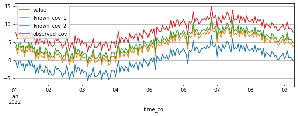
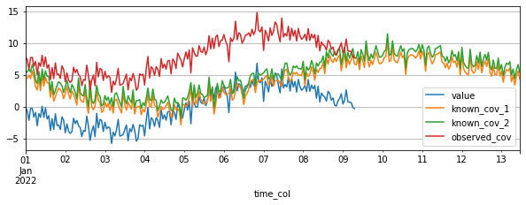
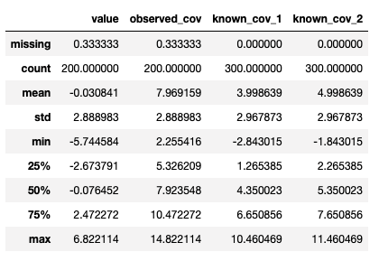
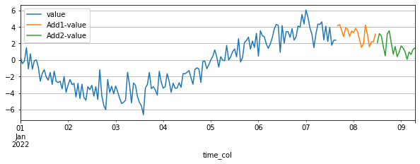

Overview
========

TSDataset
---------

`TSDataset` is the fundamental data class in `PaddleTS`, which is designed as the first-class citizen
to represent the time series data. It is widely used in `PaddleTS`. In many cases, a function consumes a TSDataset and produces another TSDataset.
A TSDataset object is comprised of two kinds of time series data: 

	1. `Target`:  the key time series data in the time series modeling tasks (e.g. those needs to be forecasted in the time series forecasting tasks).
	2. `Covariate`: the relevant time series data which are usually helpful for the time series modeling tasks.

Currently, it supports the representation of:

	1. Time series of single target w/wo covariates.
	2. Time series of multiple targets w/wo covariates. 

And the covariates can be categorized into one of the following 3 types:

	1. Observed covariates (`observed_cov`): 
		referring to those variables which can only be observed in the historical data, e.g. measured temperatures

	2. Known covariates (`known_cov`):
		referring to those variables which can be determined at present for future time steps, e.g. weather forecasts

	3. Static covariates (`static_cov`):
		referring to those variables which keep constant over time

A `TSDataset` object includes one or more `TimeSeries` objects, representing targets, 
known covariates (known_cov), observed covariates (observed_cov), and static covariates (static_cov), respectively.

TimeSeries
----------

``TimeSeries`` is the atomic data structure for representing target(s), observed covariates (observed_cov), and known covariates (known_cov). 
Each could be comprised of a single or multiple time series data.

``TimeSeries`` needs to be converted to ``TSDataset`` before used in ``PaddleTS``.

Examples
--------

Build TSDataset
~~~~~~~~~~~~~~~

Building TSDataset which contains only ``Target`` from ``DataFrame`` or CSV file

.. code:: python

   import pandas as pd
   import numpy as np
   from paddlets import TSDataset

   x = np.linspace(-np.pi, np.pi, 200)
   sinx = np.sin(x) * 4 + np.random.randn(200)
   
   df = pd.DataFrame(
       {
           'time_col': pd.date_range('2022-01-01', periods=200, freq='1h'), 
           'value': sinx
       }
   )
   target_dataset = TSDataset.load_from_dataframe(
       df,  #Also can be path to the CSV file
       time_col='time_col', 
       target_cols='value', 
       freq='1h'
   )
   target_dataset.plot()

--------------

|CUS_DATASET_2|

Building TSDataset which contains ``Target`` and ``Covariates``:

Option 1:

.. code:: python

   import pandas as pd
   from paddlets import TSDataset
   df = pd.DataFrame(
       {
           'time_col': pd.date_range('2022-01-01', periods=200, freq='1h'), 
           'value': sinx,
           'known_cov_1': sinx + 4,
           'known_cov_2': sinx + 5,
           'observed_cov': sinx + 8,
           'static_cov': [1 for i in range(200)],
       }
   )
   target_cov_dataset = TSDataset.load_from_dataframe(
       df, 
       time_col='time_col', 
       target_cols='value',
       known_cov_cols=['known_cov_1', 'known_cov_2'],
       observed_cov_cols='observed_cov',
       static_cov_cols='static_cov',
       freq='1h'
   )
   target_cov_dataset.plot(['value', 'known_cov_1', 'known_cov_2', 'observed_cov'])

--------------

|V_K2_O|

Option 2:

.. code:: python

   import pandas as pd
   from paddlets import TSDataset
   x_l = np.linspace(-np.pi, np.pi, 300)
   sinx_l = np.sin(x_l) * 4 + np.random.randn(300)

   df = pd.DataFrame(
       {
           'time_col': pd.date_range('2022-01-01', periods=300, freq='1h'), 
           'known_cov_1': sinx_l + 4,
           'known_cov_2': sinx_l + 5
       }
   )
   known_cov_dataset = TSDataset.load_from_dataframe(
       df, 
       time_col='time_col', 
       known_cov_cols=['known_cov_1', 'known_cov_2'],
       freq='1h'
   )
   df = pd.DataFrame(
       {
           'time_col': pd.date_range('2022-01-01', periods=200, freq='1h'), 
           'observed_cov': sinx + 8
       }
   )
   observed_cov_dataset = TSDataset.load_from_dataframe(
       df, 
       time_col='time_col', 
       observed_cov_cols='observed_cov',
       freq='1h'
   )
   target_cov_dataset = TSDataset.concat([target_dataset, known_cov_dataset, observed_cov_dataset])
   target_cov_dataset.plot(['value', 'known_cov_1', 'known_cov_2', 'observed_cov'])

--------------

|T_K2L_O|

Option 3:

.. code:: python

   import pandas as pd
   from paddlets import TSDataset
   from paddlets import TimeSeries
   df = pd.DataFrame(
       {
           'time_col': pd.date_range('2022-01-01', periods=300, freq='1h'), 
           'known_cov_1': sinx_l + 4,
           'known_cov_2': sinx_l + 5,
       }
   )
   known_cov_dataset = TimeSeries.load_from_dataframe(
       df, 
       time_col='time_col', 
       value_cols=['known_cov_1', 'known_cov_2'],
       freq='1h'
   )
   df = pd.DataFrame(
       {
           'time_col': pd.date_range('2022-01-01', periods=200, freq='1h'), 
           'observed_cov': sinx + 8
       }
   )
   observed_cov_dataset = TimeSeries.load_from_dataframe(
       df, 
       time_col='time_col', 
       value_cols='observed_cov',
       freq='1h'
   )
   target_cov_dataset = target_dataset.copy()
   target_cov_dataset.known_cov = known_cov_dataset
   target_cov_dataset.observed_cov = observed_cov_dataset
   target_cov_dataset.plot(['value', 'known_cov_1', 'known_cov_2', 'observed_cov'])

--------------

|T_K2L_O|

If the original dataset has missing data, we can fill missing data during the loading process by using ``load_from_dataframe``. 
We provide 7 fill methods listed below.

.. code:: python

   import pandas as pd
   import numpy as np
   from paddlets import TSDataset
   df = pd.DataFrame(
       {
           'time_col': pd.date_range('2022-01-01', periods=200, freq='1h'), 
           'value': sinx,
           'known_cov_1': sinx + 4,
           'known_cov_2': sinx + 5,
           'observed_cov': sinx + 8,
           'static_cov': [1 for i in range(200)],
       }
   )
   df.loc[1, 'value'] = np.nan
   target_cov_dataset = TSDataset.load_from_dataframe(
       df, 
       time_col='time_col', 
       target_cols='value',
       known_cov_cols=['known_cov_1', 'known_cov_2'],
       observed_cov_cols='observed_cov',
       static_cov_cols='static_cov',
       freq='1h',
       fill_missing_dates=True,
       fillna_method='pre' #max, min, avg, median, pre, back, zero
   )
   print(target_cov_dataset['value'][1])

::

   #0.0

Data Exploration
~~~~~~~~~~~~~~~~

Plot TSDataset.

::

   target_cov_dataset.plot(['value'])

--------------

| |CUS_DATASET_2|

To get the summary statistics of TSDataset, simply call ``TSDataset.summary``.

::

   target_cov_dataset.summary()

--------------

| |ALL_SUMMARY|

Creating the training, validation, and testing datasets
~~~~~~~~~~~~~~~~~~~~~~~~~~~~~~~~~~~~~~~~~~~~~~~~~~~~~~~~

.. code:: python

   train_dataset, val_test_dataset = target_cov_dataset.split(0.8)
   val_dataset, test_dataset = val_test_dataset.split(0.5)
   train_dataset.plot(add_data=[val_dataset,test_dataset])

--------------

|T_V_T_2|

Add columns
~~~~~~~~~~~

.. code:: python

   train_dataset
   new_line = pd.Series(
        np.array(range(200)),
        index=pd.date_range('2022-01-01', periods=200, freq='1D')
   )

   ## option 1:
   ## The name of new column which need not to exists in TSDataset`s columns
   ## The type of value is pd.Series
   ## type represent the TimeSeries where to put the new column, konw_cov by default
   ## The index of value must be same as the index of the TSDataset object
   target_cov_dataset.set_column(
        column='new_b', 
        value=new_line, 
        type='observed_cov'
   )

   ## option 2: 
   ## The option is equal to option 1 which type is default
   target_cov_dataset['new_b'] = new_line

Update columns
~~~~~~~~~~~~~~

.. code:: python

   ## option 1:
   ## The name of new column which need to exists in TSDataset`s columns
   ## The type of value is pd.Series
   ## The index of value must be same as the index of the TSDataset object
   target_cov_dataset.set_column(
        column='observed_cov', 
        value=new_line
   )

   ## Option 2:
   ## No different from option 1
   target_cov_dataset['observed_cov'] = new_line

Delete columns
~~~~~~~~~~~~~~

.. code:: python

   ## Delete column
   target_cov_dataset.drop('new_b')
   ## Delete columns
   target_cov_dataset.drop(['known_cov_1', 'new_b'])

Get columns
~~~~~~~~~~~~~~

.. code:: python

   ## Get column
   column = target_cov_dataset['known_cov_2'] # The type of column is pd.Serie
   ## Get columns
   columns = target_cov_dataset[['known_cov_2', 'observed_cov']] # The type of columns is pd.DataFrame

Get data type
~~~~~~~~~~~~~
.. code:: python

   dtypes = target_cov_dataset.dtypes
   print(dtypes)

::

   value           int64
   known_cov_1     int64
   known_cov_2     int64
   observed_cov    int64
   dtype: object

Modify dtype
~~~~~~~~~~~~
.. code:: python

   target_cov_dataset.astype('float32')
   dtypes = target_cov_dataset.dtypes
   print(dtypes)

::

   value           float32
   known_cov_1     float32
   known_cov_2     float32
   observed_cov    float32
   dtype: object

Get column names 
~~~~~~~~~~~~~~~~
.. code:: python

   columns = target_cov_dataset.columns
   print(columns)

::

   #{'value': 'target', 'known_cov_1': 'known_cov', 'known_cov_2': 'known_cov', 'observed_cov': 'observed_cov'}

.. |CUS_DATASET_2| image:: ../../../static/images/CUS_DATASET_2.png

