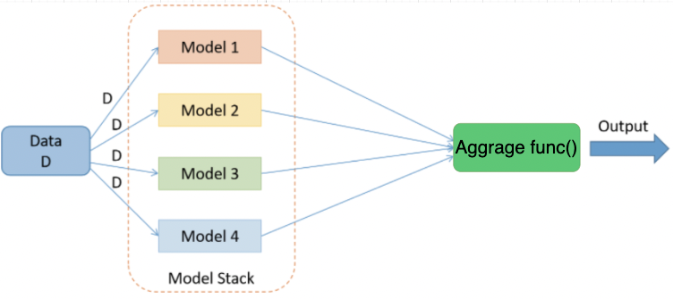
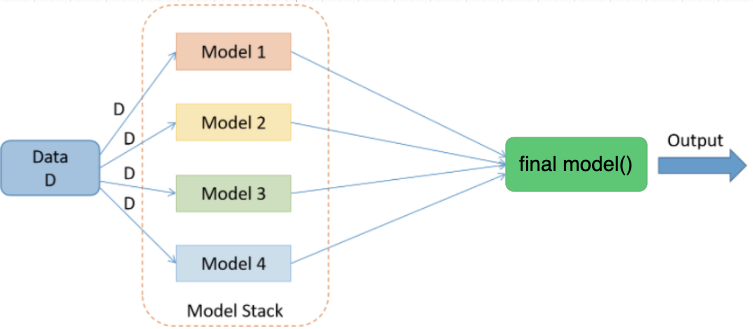

=====================
Ensemble Forecaster 
=====================

Ensemble Forecaster following methods of ensemble learning to aggragate multiple PaddleTS forecaster to one
ensemble model. Currently we propose two types of ensemble forecaster, StackingEnsembleForecaster and WeightingEnsembleForecaster.

1. Prepare Data
====================================
1.1. Get Data
--------------------
Get PaddleTS inner-build datasets.

.. code:: python

    from paddlets.datasets.repository import get_dataset
    tsdataset = get_dataset("WTH")

1.2. Split Data
--------------------
Split dataset into train/test/valid.

.. code:: python

    ts_train, ts_val_test = tsdataset.split("2012-03-31 23:00:00")
    ts_val, ts_test = ts_val_test.split("2013-02-28 23:00:00")

1.3. Preprocess (Optional)
---------------------------
Use StandardScaler to nomalize data.(Optional)

.. code:: python

    from paddlets.transform.sklearn_transforms import StandardScaler
    scaler = StandardScaler()
    scaler.fit(ts_train)
    ts_train = scaler.transform(ts_train)
    ts_val = scaler.transform(ts_val)
    ts_test = scaler.transform(ts_test)
    ts_val_test = scaler.transform(ts_val_test)

2. Prepare Models
=================
Prepare base models for ensemble model.

Please notice that, to keep the consistancy of models fit and predict, 
params  ``in_chunk_len``, ``out_chun_len``, ``skip_chunk_len`` was extracted into Ensemble models, you can
ignore this three params for model.

.. code:: python
    
    from paddlets.models.forecasting import MLPRegressor
    from paddlets.models.forecasting import NHiTSModel
    from paddlets.models.forecasting import RNNBlockRegressor

    nhits_params = {
        'sampling_stride': 24,
        'eval_metrics':["mse", "mae"],
        'batch_size': 32,
        'max_epochs': 10,
        'patience': 100
    }
    rnn_params = {
        'sampling_stride': 24,
        'eval_metrics': ["mse", "mae"],
        'batch_size': 32,
        'max_epochs': 10,
        'patience': 100,
    }
    mlp_params = {
        'sampling_stride': 24,
        'eval_metrics': ["mse", "mae"],
        'batch_size': 32,
        'max_epochs': 10,
        'patience': 100,
        'use_bn': True,
    }

3. Construct and Fitting
===================================
Construct and fitting ensemble forecaster, WeightingEnsembleForecaster or StackingEnsembleForecaster.

3.1. Construct and Fitting WeightingEnsembleForecaster
-------------------------------------------------------

|fig_1| 

WeightingEnsembleForecaster use a aggragate function to aggragate base model predictions, use "mean" mode by default.
More infomation about WeightingEnsembleForecaster please read `WeightingEnsembleForecaster doc <../../api/paddlets.ensemble.weighting_ensemble_forecaster.html>`_ .

Example1 

Use default mode by default (default mode is "mean")

.. code:: python

    from paddlets.ensemble import WeightingEnsembleForecaster

    reg = WeightingEnsembleForecaster(
    in_chunk_len=7 * 24,
    out_chunk_len=24,
    skip_chunk_len=0,
    estimators=[(NHiTSModel, nhits_params),(RNNBlockRegressor, rnn_params), (MLPRegressor, mlp_params)])

    reg.fit(ts_train, ts_val)

Example2 

Use selected weighting mode

.. code:: python

    from paddlets.ensemble import WeightingEnsembleForecaster
    
    #get mode list
    WeightingEnsembleForecaster.get_support_modes()
    #Supported ensemble modes:['mean', 'min', 'max', 'median']

    #select mode
    reg = WeightingEnsembleForecaster(
    in_chunk_len=7 * 24,
    out_chunk_len=24,
    skip_chunk_len=0,
    estimators=[(NHiTSModel, nhits_params),(RNNBlockRegressor, rnn_params), (MLPRegressor, mlp_params)],
    mode = "min")

    reg.fit(ts_train, ts_val)

3.2. Construct and Fitting StackingEnsembleForecaster
--------------------------------------------------------

|fig_2| 

StackingEnsembleForecaster use a final learner to fit the base model predictions,  use GradientBoostingRegressor(max_depth=5) by default.
It has been verified that stacking ensemble can achieve better results than the underlying model in many cases.
More infomation about StackingEnsembleForecaster please read `StackingEnsembleForecaster doc <../../api/paddlets.ensemble.stacking_ensemble_forecaster.html>`_ .

Example1 

Use default final_learner by default (default learner is GradientBoostingRegressor(max_depth=5))

.. code:: python

    from paddlets.ensemble import StackingEnsembleForecaster

    reg = StackingEnsembleForecaster(
    in_chunk_len=7 * 24,
    out_chunk_len=24,
    skip_chunk_len=0,
    estimators=[(NHiTSModel, nhits_params),(RNNBlockRegressor, rnn_params), (MLPRegressor, mlp_params)])

    reg.fit(ts_train, ts_val)

Example2 

Use self defined final learner

.. code:: python

    from sklearn.linear_model import Ridge
    from paddlets.ensemble import StackingEnsembleForecaster

    reg = StackingEnsembleForecaster(
    in_chunk_len=7 * 24,
    out_chunk_len=24,
    skip_chunk_len=0,
    estimators=[(NHiTSModel, nhits_params),(RNNBlockRegressor, rnn_params), (MLPRegressor, mlp_params)],
    final_learner=Ridge(alpha=0.5))

    reg.fit(ts_train, ts_val)

4. Backtest on Ensemble Forecaster
===================================

.. code:: python

    from paddlets.utils import backtest
    from paddlets.metrics import MAE
    mae, ts_pred = backtest(data=ts_val_test,
                    model=reg,
                    start="2013-03-01 00:00:00",  # the point after "start" as the first point
                    metric=MAE(),
                    predict_window=24,  
                    stride=24,  
                    return_predicts=True  
                    )

