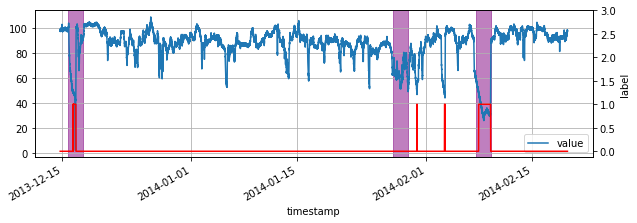

====================================
Anomaly Detection Model Tutorial
====================================

PaddleTS provides the components of time series anomaly detection, mainly including:

    - The TSDataset is designed to adapt to the data characteristics of the time series anomaly detection scenario. For details, refer to: `TSDataset Document <../datasets/overview.html>`_.
    - Some data visualization methods are provided to facilitate users to understand data more intuitively.
    - Several time series anomaly detection deep neural network models have been implemented, including the classic model such as AutoEncoder, VAE and the state-of-the art model Anomaly Transfomer. At the same time, the `AnomalyBaseModel` base class is provided to facilitate developers to build new time series anomaly detection models.
    - Support automatic integration of machine learning models in the third-party anomaly detection library `pyod`, and adapt time series data to give users more modeling options when the data volume is relatively small.
    - The evaluation operators applicable to anomaly detection scenarios are provided, including Precision, Recall and F1.

An example
=================
The following example shows how to use the built-in AutoEncoder model to do an anomaly detection task based on PaddleTS.

1. Prepare data
---------------------------

The built-in API: `get_dataset` is used to load nab_temp dataset: `NAB_TEMP`.

.. code-block:: python

   from paddlets.datasets.repository import get_dataset

   ts_data = get_dataset('NAB_TEMP') # label_col: 'label', feature_cols: 'value'

2. Data visualization
---------------------------

Display the dataset and anomaly windows through the visual interface provided by PaddleTS.

.. code-block:: python

   from paddlets.utils.utils import plot_anoms

   plot_anoms(origin_data=ts_data, feature_name="value")

3. Data processing
---------------------------

Set up training set (top 15%), and standardize the data.

.. code-block:: python

   import paddle
   import numpy as np
   from paddlets.transform import StandardScaler

   #set seed
   seed = 2022
   paddle.seed(seed)
   np.random.seed(seed)
   train_tsdata, test_tsdata = ts_data.split(0.15)

   #standardize
   scaler = StandardScaler()
   scaler.fit(train_tsdata)
   train_tsdata_scaled = scaler.transform(train_tsdata)
   test_tsdata_scaled = scaler.transform(test_tsdata)

4. Train model
---------------------------

Training anomaly detection model.

.. code-block:: python

   from paddlets.models.anomaly import AutoEncoder

   model = AutoEncoder(in_chunk_len=2, max_epochs=100)
   model.fit(train_tsdata_scaled)

5. Model prediction and evaluation
-----------------------------------

Use the trained model for prediction and evaluation.

.. code-block:: python

   from paddlets.metrics import F1,ACC,Precision,Recall
   
   pred_label = model.predict(test_data_scaled)
   lable_name = pred_label.target.data.columns[0]
   f1 = F1()(test_tsdata, res)
   precision = Precision()(test_tsdata, res)
   recall = Recall()(test_tsdata, res)
   print ('f1: ', f1[lable_name])
   print ('precision: ', precision[lable_name])
   print ('recall: ', recall[lable_name])

6. Visualization of prediction results
---------------------------------------

Compare the prediction results withe the true labels.

.. code-block:: python

   plot_anoms(origin_data=test_tsdata, predict_data=pred_label, feature_name="value")
   

The model also provides `predict_score` interface returns the anomaly score of each point. The higher the score, the higher the probability of anomaly.

.. code-block:: python

   pred_score = model.predict_score(test_data_scaled)
   plot_anoms(origin_data=test_tsdata, predict_data=pred_score, feature_name="value")
   

7. Model persistence
---------------------------

The trained model can be saved to the specified path.

.. code-block:: python

   model.save('./model_path/ae')

After the model is saved, the model can be loaded for new data prediction.

.. code-block:: python

   from paddlets.models.model_loader import load

   loaded_model = load('./model_path/ae')
   pred_label = loaded_model.predict(test_data_scaled)
   pred_score = loaded_model.predict_score(test_data_scaled)
