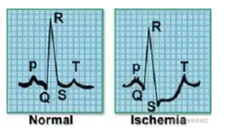
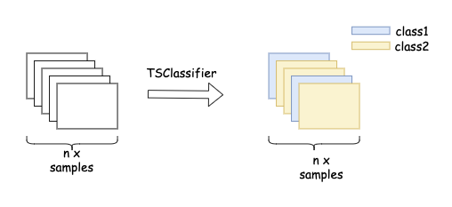

=========================================
Tutorial of Time Series Classification
=========================================

What is Time Series Classification?

Time series classification is a general task that has been applied in many fields. The purpose is to determine which predefined category a time series belongs to by using labeled training data. Time series classification is different from conventional classification because time series data is a sequence with order attribute.

The ECG signal sample shown in the figure below represents a heartbeat activity. It can be distinguished according to different signal characteristics. The left represents normal heartbeat, while the right represents myocardial infarction. (Data from https://timeseriesclassification.com/description.php?Dataset=ECG200）

It can be seen that we define a time series classification problem as the classification of time series. In the above example, each ECG is a data sample, and each data sample will correspond to a classified label. As shown in the figure below, the input of the model can be n TSDataset.

PaddleTS provides the components of time series classification, mainly including:

    - The TSDataset data structure is used to adapt the data characteristics of the time series classification scenario, such as the ECG example above.
    - It has implemented two deep learning models for time series classification, including  CNN and InceptionTime. It also provides the ClassifyBaseModel, which facilitates developers to build new time series classification models.
    - Accuracy is supported by default to evaluates the time series classification, and also applies the relevant evaluation operator of sklearn.metrics to evaluate the time series classification results.

An example
=================
The following example uses the built-in CNN model to do an time series classification task based on PaddleTS.

1. Prepare data
---------------------------

The built-in API: `get_dataset` is used to load BasicMotions dataset: `BasicMotions`.

.. code-block:: python

   from paddlets.datasets.repository import get_dataset

   ts_x_trains, y_train = get_dataset("BasicMotions_Train")
   ts_x_tests, y_test = get_dataset("BasicMotions_Test")

2. Train model
---------------------------

Training time series classification model.

.. code-block:: python

   from paddlets.models.classify.dl.cnn import CNNClassifier

   network = CNNClassifier(max_epochs=1000, patience=50)
   network.fit(ts_x_trains, y_train)

3. Model prediction and evaluation
-----------------------------------

Use the trained model for prediction and evaluation.

.. code-block:: python

   from sklearn.metrics import accuracy_score, f1_score

   preds = network.predict(ts_x_tests)
   score = accuracy_score(y_test, preds)
   f1 = f1_score(y_test, preds, average="macro")

4. Probability Forecasting
---------------------------------------

Return probability of each class.

.. code-block:: python

   preds = network.predict_proba(ts_x_tests)

5. Model persistence
---------------------------

The trained model can be saved to the specified path.

.. code-block:: python

   network.save('./model/cnn')

After the model is saved, the model can be loaded for new data prediction.

.. code-block:: python

   from paddlets.models.classify.dl.paddle_base import PaddleBaseClassifier

   load_network = PaddleBaseClassifier.load('./model/cnn')
