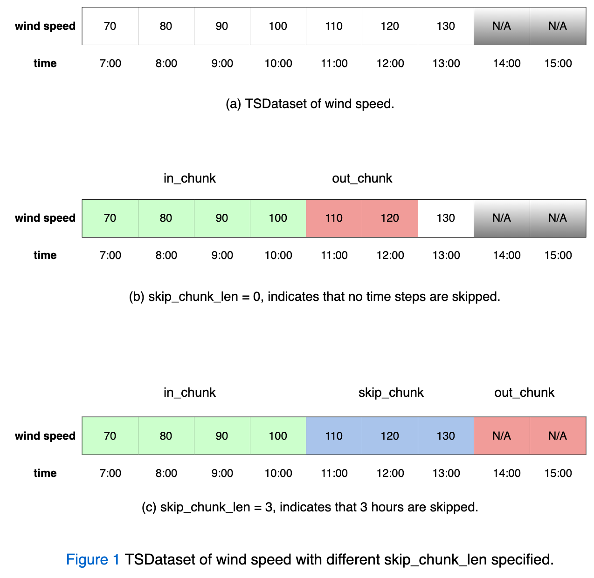
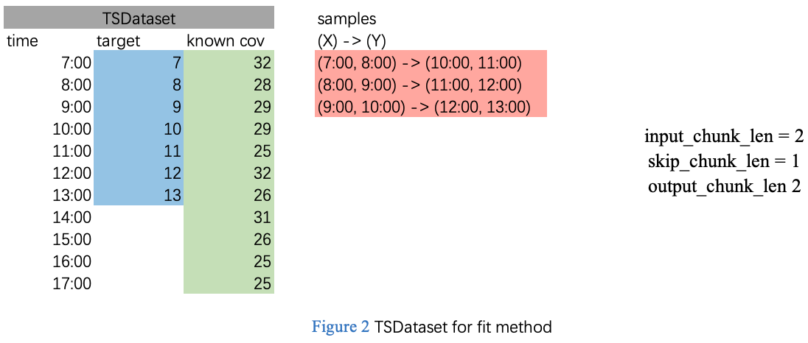
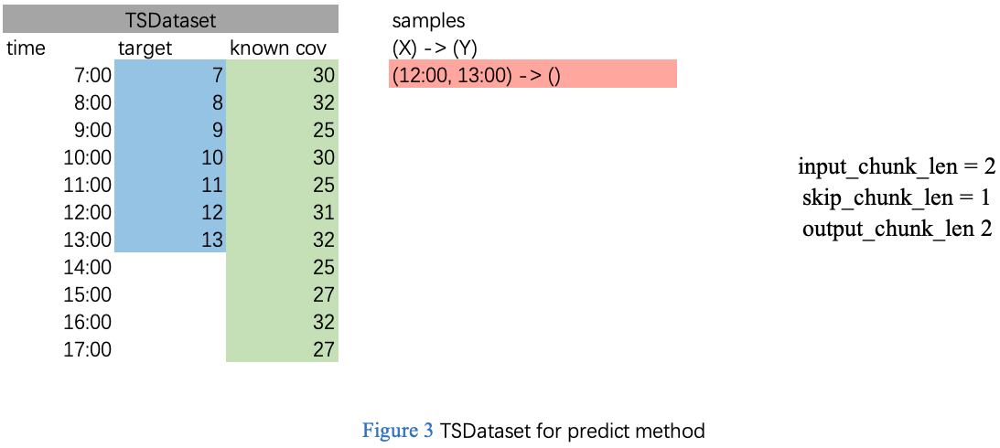

===================
Forecasting Models
===================

Before reading this document, it is recommended to first read the `TSDataset Document <../datasets/overview.html>`_ to understand the design of `TSDataset`.
Simply speaking, `TSDataset` is a unified time series data structure throughout the whole modeling lifecycle.
It introduces several fundamental but important time series related concepts such as
``target`` (including ``past_target`` and ``future_target``) and ``covariates`` (including ``known_covariates`` and ``observed_covariates``).
A good understanding of those concepts would be helpful for deep diving into this documentation and building well-performed models.

PaddleTS provides three high-level features for deep time series modeling:

- Standard interfaces. The interfaces (`fit`, `predict`) declared in `PaddleBaseModel` are designed to
  accept and return the unified `TSDataset` as both input and output to encapsulate the complicated details of
  processing TSDataset and building samples, simplify the API usage and reduce the learning cost.
- PaddleTS introduces the `PaddleBaseModelImpl` class, which consists of a set of common functions and components throughout
  the modeling lifecycle (e.g. _prepare_X_y, _init_metrics, compute_loss, etc.). This allows users to focus more on the network
  architecture and provides maximum convenience for the developers to build new models.
- Out-of-box models. PaddleTS provides off-the-shelf deep time series models:

  - `DeepAR <../../api/paddlets.models.forecasting.dl.deepar.html>`_
  - `Informer <../../api/paddlets.models.forecasting.dl.informer.html>`_
  - `LSTNet(Long Short-term Time-series Network) <../../api/paddlets.models.forecasting.dl.lstnet.html>`_
  - `MLP(Multilayer Perceptron) <../../api/paddlets.models.forecasting.dl.mlp.html>`_
  - `NBEATS <../../api/paddlets.models.forecasting.dl.nbeats.html>`_
  - `NHiTS <../../api/paddlets.models.forecasting.dl.nhits.html>`_
  - `RNN <../../api/paddlets.models.forecasting.dl.rnn.html>`_
  - `SCINet(Sample Convolution Interaction Network) <../../api/paddlets.models.forecasting.dl.scinet.html>`_
  - `TCN(Temporal Convolution Net) <../../api/paddlets.models.forecasting.dl.tcn.html>`_
  - `TFT(Temporal Fusion Transformer) <../../api/paddlets.models.forecasting.dl.tft.html>`_
  - `Transformer <../../api/paddlets.models.forecasting.dl.transformer.html>`_

1. A minimal example
=======================

Below minimal example uses a built-in `RNNBlockRegressor` model to illustrate the basic usage.

.. code-block:: python

   from paddlets import TSDataset
   from paddlets.models.model_loader import load
   from paddlets.models.forecasting import RNNBlockRegressor

   # 1 prepare the data
   data = TSDataset.load_from_csv("/path/to/data.csv")

   # 2 data preprocessing and feature engineering
   # NB:
   # Consider simplifying the example, all these important processes are skipped here.
   # Please refer to the following documentation to get more details if needed:
   # https://paddlets.readthedocs.io/en/latest/source/modules/transform/overview.html

   # 3 init the model instance.
   model = RNNBlockRegressor(in_chunk_len=96, out_chunk_len=96)

   # 4 fit
   model.fit(train_tsdataset=data)

   # 5 predict
   predicted_dataset = model.predict(data)

   # 6 recursive predict
   recursive_predicted_dataset = model.recursive_predict(data, predict_length= 3 * 96)

   # 7 save the model
   model.save("/path/to/save/modelname")

   # 8 load the model
   loaded_model = load("/path/to/save/modelname")

2. PaddleBaseModel
=====================

PaddleBaseModel is the base class for all PaddlePaddle-based time series models.
Below is a simplified version of the **PaddleBaseModel** class declaration,
the lengthy implementation details are skipped,
you may refer to the `PaddleBaseModel API <../../api/paddlets.models.forecasting.dl.paddle_base.html>`_ to get a full view.

2.1. Construct method
------------------------

.. code-block:: python

   import abc

   from paddlets.models.base import BaseModel

   class PaddleBaseModel(BaseModel, metaclass=abc.ABCMeta):
       def __init__(
           self,
           in_chunk_len: int,
           out_chunk_len: int,
           skip_chunk_len: int = 0
       ):
           super(PaddleBaseModel, self).__init__(
               in_chunk_len=in_chunk_len,
               out_chunk_len=out_chunk_len,
               skip_chunk_len=skip_chunk_len
           )
           # other details are skipped

As shown above, the constructor takes 2 required arguments and an optional argument:

- in_chunk_len: The size of the loopback window, i.e. the number of time steps feed to the model.
- out_chunk_len: The size of the forecasting horizon, i.e. the number of time steps output by the model.
- skip_chunk_len: Optional, the number of time steps between in_chunk and out_chunk for a single sample.
  The skip chunk is neither used as a feature (i.e. X) nor a label (i.e. Y) for a single sample.
  By default it will NOT skip any time steps.

Below Figure 1 shows a concrete example to further explain the above concepts.

Figure 1(a) defines a TSDataset of wind speed with an HOURLY level frequency.
It totally contains 7 hours of wind speed data starts at 7:00 and ends at 13:00.
Note that the grey shaded wind speed of 14:00 and 15:00 are NOT contained in the given TSDataset.

Figure 1(b) sets the `in_chunk_len` = 4, `skip_chunk_len` = 0, `out_chunk_len` = 2, which indicates the following:

- A 4-hour contiguous chunk of wind speed start at 7:00, i.e., [70, 80, 90, 100], will be treated as in_chunk.
- A 2-hour contiguous chunk of wind speed start at 11:00, which follows behind the in_chunk, i.e., [110, 120], will be treated as out_chunk.
- As the `skip_chunk_len` is set to 0, no time units between in_chunk and out_chunk are skipped.

The value of `in_chunk_len` and `out_chunk_len` shown in Figure 1(c) are identical to that of Figure 1(b), except that the `skip_chunk_len` is different.
More specifically, Figure 1(c) sets the `in_chunk_len` = 4, `skip_chunk_len` = 3, `out_chunk_len` = 2, which indicates the following:

- A 4-hour contiguous chunk of wind speed start at 7:00, i.e., [70, 80, 90, 100], will be treated as in_chunk.
- A 3-hour contiguous chunk of wind speed start at 11:00, which follows behind the in_chunk, i.e., [110, 120, 130], will be skipped.
- A 2-hour contiguous chunk of wind speed start at 14:00, which follows behind the skip_chunk, i.e., [140, 150], will be treated as out_chunk.

In conclusion, the current model will use the wind speed of the past 4 hours to predict the wind speed of the future 2 hours.
Meanwhile, it can skip several hours between in_chunk and out_chunk by setting the optional argument `skip_chunk_len` to any positive integer.

2.2. Fit
------------

All the time series models in PaddleTS have the same fit interface.

To allow users to focus more on the higher level view,
the fit method accepts TSDatasets as the training data argument rather than an array-like feature matrix,
which encapsulates the details of splitting TSDataset into a set of samples.

The simplified fit method is as follows:

.. code-block:: python

   import abc
   from typing import Optional

   from paddlets.models.base import BaseModel
   from paddlets import TSDataset

   class PaddleBaseModel(BaseModel, metaclass=abc.ABCMeta):
       # other contents are skipped.
       def fit(
           self,
           train_data: TSDataset,
           valid_data: Optional[TSDataset] = None
       ):
           pass

See below Figure 2 for further explanation:

In this case, the fit method takes the above grey-highlighted TSDataset as the train_data argument
and internally split the TSDataset into a set of samples (i.e. red-highlighted in the above figure).

2.3. Predict
---------------

All models have the same predict interface. It accepts a TSDataset argument contains both `past target` and corresponding covariates,
then make prediction on the `past target` and return a newly built TSDataset as the predicted result.
The returned TSDataset contains a `future target` time series chunk, with length equals to `out_chunk_len`.

The following points are worthwhile to be aware of:

- The TSDataset argument of this method only contains the past target and corresponding covariates, but not contain the future target.
- The predict method only constructs one sample from the TSDataset argument.
- The length of the predicted result for a single `predict` call is equal to out_chunk_len.

Below is the simplified `predict` method:

.. code-block:: python

   import abc

   from paddlets.models.base import BaseModel
   from paddlets import TSDataset

   class PaddleBaseModel(BaseModel, metaclass=abc.ABCMeta):
       # other contents are skipped.
       def predict(self, data: TSDataset) -> TSDataset:
           pass

We will further explain it through a concrete example. Suppose we have a TSDataset shown in the below Figure 3:

given in_chunk_len = 2, out_chunk_len = 2, skip_chunk_len = 1, the following statements hold:

- The data between 7:00 and 13:00 will all be treated as the `past target`.
- As only one sample will be constructed per each call, while known that in_chunk_len = 2, skip_chunk_len = 1, out_chunk_len = 2,
  thus the data between 12:00 and 13:00 will be fed to the fitted model to predict the future data between 15:00 and 16:00,
  where the data at 14:00 is skipped.

2.4. Recursive predict
-------------------------
All models have the same `model.recursive_predict` interface. The recursive strategy involves applying `model.predict` method
iteratively for multi-step time series forecasting.
The predicted results from the current call will be appended to the given `TSDataset` object and will appear in the
loopback window for the next call.

Note that each call of `model.predict` will return a result of length `out_chunk_len`, so `model.recursive_predict`
will be called ceiling(`predict_length`/`out_chunk_len`) times to meet the required length.

For example, the `out_chunk_length` of the model mentioned before is 96, but `model.recursive_predict` allows you to set `predict_length`
as 3 * 96 or more, then you get a predicted result of length 3 * 96.

.. code-block:: python

   # 6 recursive predict
   recursive_predicted_dataset = model.recursive_predict(data, predict_length= 3 * 96)

Note that `model.recursive_predict` is not supported when `model.skip_chunk` != 0.

For detailed usage, please refer to `API: BaseModel.recursive_predict <../../api/paddlets.models.base.html#paddlets.models.base.BaseModel.recursive_predict>`_ .

For advanced predict-related capability `Backtest`, please refer to `API: Backtest <../../api/paddlets.utils.backtest.html>`_ .

2.5. Model persistence
--------------------------

After fitting a PaddleBaseModel, it is necessary to have a way to persist the model for future use without retraining the model.
We also provide a unified method to load a persisted PaddleBaseModel from disk.

The following sections show you how to persist a PaddleBaseModel. Note that a model can be saved multiple times.

.. code-block:: python

   from paddlets import TSDataset
   from paddlets.models.forecasting import RNNBlockRegressor

   # Prepare a fitted model
   training_data = TSDataset.load_from_csv("/path/to/csv")

   model = RNNBlockRegressor(in_chunk_len=96, out_chunk_len=96)

   model.fit(train_tsdataset=training_data)

   # save the model for multiple times.
   model.save("/path/to/save/modelname_1")
   model.save("/path/to/save/modelname_2")

Later you can load back the persisted model with:

.. code-block:: python

   from paddlets.models.model_loader import load

   loaded_rnn_reg_1 = load("/path/to/save/modelname_1")
   loaded_rnn_reg_2 = load("/path/to/save/modelname_2")
