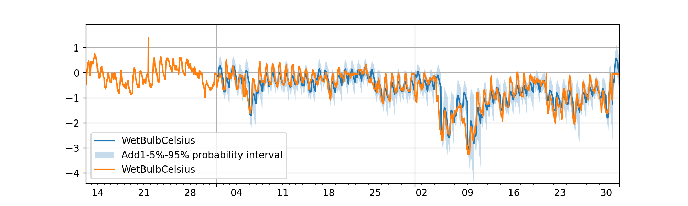

========================
Probability Forecasting
========================

PaddleTS provides professional probability forecasting modules:

- High performance probability forecasting models.
- Likelihood models.
- Specific loss functions and metrics.

An example
==========

We use a build-in `DeepAR` model to illustrate the base use of probability forecasting.

.. code-block:: python

   from paddlets.datasets.tsdataset import TSDataset
   from paddlets.models.forecasting import DeepARModel
   from paddlets.metrics import MAE
   from paddlets.metrics import MSE
   from paddlets.metrics import QuantileLoss

1. Data load and processing
---------------------------

The built-in API: `get_dataset` is used to load dataset whether dataset: `WTH`.

.. code-block:: python

   ts = get_dataset("WTH")

By feature engineering, time features are added to the dataset.

.. code-block:: python
   
   time_f = TimeFeatureGenerator(["month", "weekday", "hour", "dayofyear", "weekofyear"])
   ts = time_f.fit_transform(ts)

At last, scaling is necessary to normalize all features to the same magnitude.

.. code-block:: python
   
   scaler = StandardScaler()
   scaler.fit(ts_train)
   ts_train_scaled = scaler.transform(ts_train)
   ts_val_scaled = scaler.transform(ts_val)
   ts_test_scaled = scaler.transform(ts_test)

2. Training a model
---------------------

Be different from other point forecasting models, the built-in `DeepARModel` has several specific parameters.
For `regression_mode`, users may select `sampling` or `mean` to set the regression mode, for `output_mode`, `quantiles`
and `predictions` are optional, `quantiles` will output the satandard quantiles result for probability while `predictions`
only output single forecasting point, which degernerates the model to point forecasting.

.. code-block:: python
   
   deepar = DeepARModel(
        in_chunk_len = 7 * 24,
        out_chunk_len = 24,
        sampling_stride = 24,
        max_epochs=100,
        optimizer_params = dict(learning_rate=1e-3),
        batch_size = 32,
        patience=20,
        num_samples = 101,
        regression_mode="sampling",
        output_mode="quantiles"
    )
   deepar.fit(ts_train_scaled, ts_val_scaled)

3. Prediction and evaluate
---------------------------

The build-int API `backtest` is used for both prediction and evaluation, quantile loss and quantile result are returned.

.. code-block:: python
   
   from paddlets.utils import backtest
   q_loss, quantiles = backtest(data=ts_test_scaled,
        model=deepar,
        start="2013-11-01 00:00:00",
        metric=QuantileLoss([0.1, 0.5, 0.9]),
        predict_window=24,
        stride=24,
        return_predicts=True
   )

4. Visualization
------------------

The new updated API `plot` fits probability forecasting well, by setting `low_quantile` and `high_quantile`, the 
predictions curve and confidence interval will show on the plot.

.. code-block:: python
   
   %matplotlib notebook
   quantiles.plot(
        add_data= ts_test_scaled,
        low_quantile=0.05,
        high_quantile=0.95
    )

