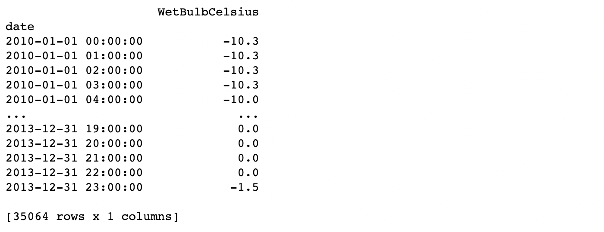
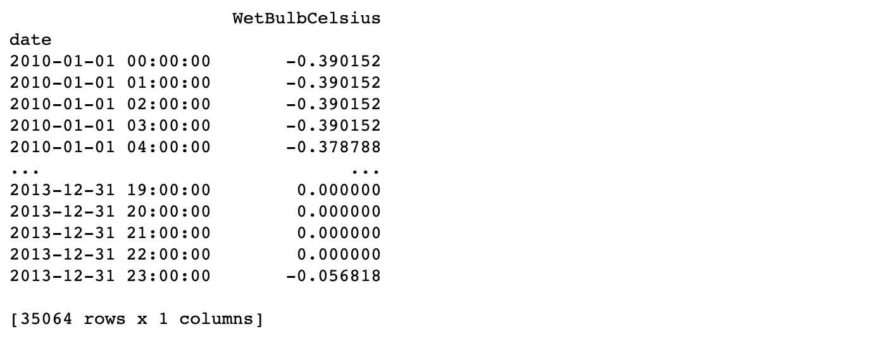
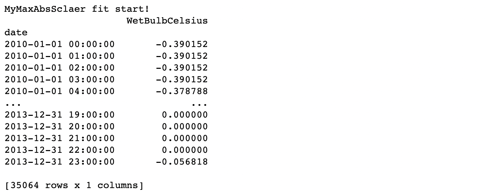

=====================================
Third-Party And User-Define Transform
=====================================

1. Third-Party Transform 
========================

(The current version supports ``sklearn style`` dataset transformations)

Paddlets introduces the ``make_ts_transform`` function, which can wrap the universal third-party data transformation modules into paddlets easily.

.. code-block:: python

   from paddlets.datasets.repository import get_dataset
   dataset = get_dataset('UNI_WTH')
   print(dataset)

|UNI_WTH_DATA|

.. code-block:: python

   from paddlets.transform import make_ts_transform
   from sklearn.preprocessing import MaxAbsScaler
   ts_max_abs_scaler = make_ts_transform(
       MaxAbsScaler,
       drop_origin_columns=True,
       per_col_transform=True
   )
   dataset = ts_max_abs_scaler.fit_transform(dataset)
   print(dataset)

|UNI_WTH_ABS|

As shown in the above example, one can instantiate the ``MaxAbsScaler`` module in ``sklearn`` into a ``ts_max_abs_scaler`` object through ``make_ts_transform``.
``make_ts_transform`` realizes automatic encapsulation of ``MaxAbsScaler`` object, which support the trasnfrom of time-series data while retaining its core functions.
The interfaces of ``ts_max_abs_scaler`` consumes a TSDataset and produces another TSDataset. 
We can use the transformations object which build by ``make_ts_transform`` just like using the built-in data transformations module, it has the same interface and functions as the built-in module. 
Below example illustrates the usage in pipeline.

.. code-block:: python

   from paddlets.transform import KSigma, TimeFeatureGenerator
   transfrom_list = [
       KSigma("cols":["observed_a", "observed_b", "known_c", "known_d"], "k": 1), 
       TimeFeatureGenerator(),
       ts_max_abs_scaler    
   ]
   for transformer in transfrom_list:
       dataset = transformer.fit_transform(dataset)

2. User-Define Transform
========================

``make_ts_transform`` function can also wrap the user-define data transformations modules into paddlets.

.. code-block:: python

   from sklearn.preprocessing import MaxAbsScaler
   class MyMaxAbsSclaer(MaxAbsScaler):
       def fit(self, dataset):
           print("MyMaxAbsSclaer fit start!")
           return super().fit(dataset)

.. code-block:: python

   ts_my_max_abs_scaler = make_ts_transform(
       MyMaxAbsSclaer,
       drop_origin_columns=True,
       per_col_transform=True
   )
   dataset = ts_my_max_abs_scaler.fit_transform(dataset)
   print(dataset)

|UNI_WTH_MY_ABS|

``make_ts_transform`` function can also wrap universal third-party or the user-define data transformations modules into paddlets. 
For third-party modules, not all data transformations modules are suitable for processing time-series data; at the same time, user-define modules is even more uncontrollable. 
So ``make_ts_transform`` includes the logic to check the legitimacy of its encapsulated functions. It will check the legitimacy based on the input dataset and output dataset, 
so as to avoid the import of some illegal modules leading to abnormalities in subsequent processes, which increases the difficulty of troubleshooting.

