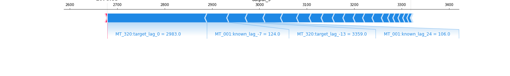
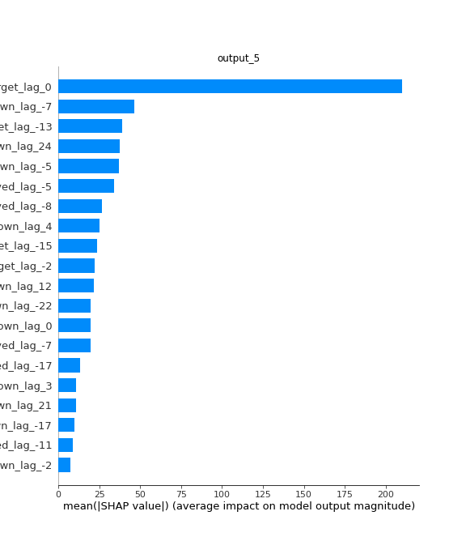
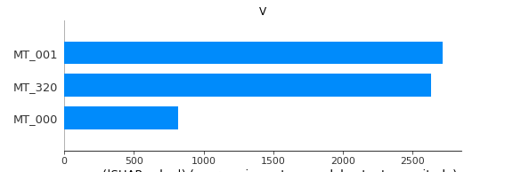
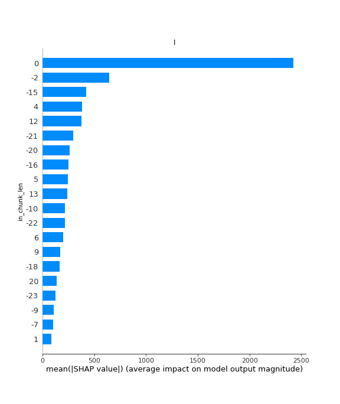
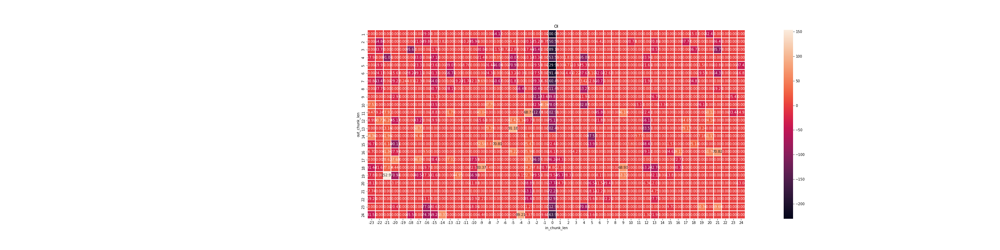
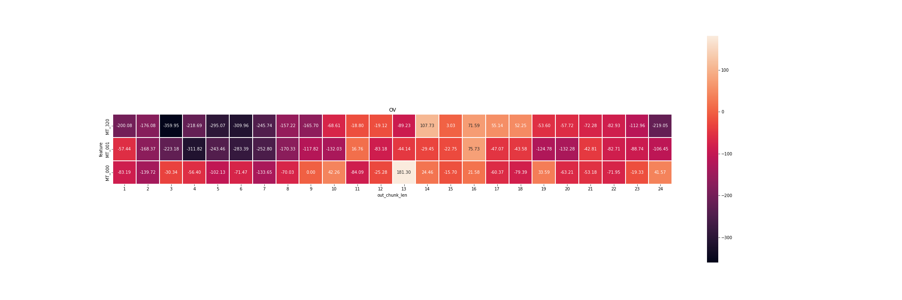
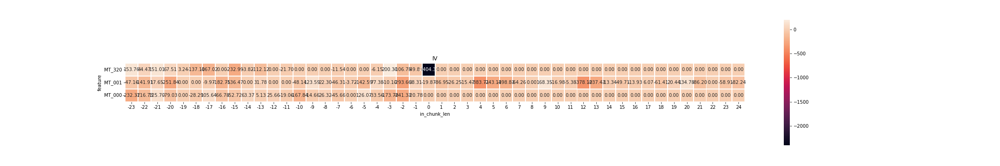

=====================
XAI
=====================

Xai is a model interpretation module, which can explain how complex model prediction results are formed, and help users quickly understand the relationship between input and output. At present, the xai module is divided into two sub-modules: `ante_hoc` and `post_hoc`. The former provides interpretability based on the designed model network structure, while the latter has nothing to do with the model network, but interprets the original model through the proxy model.

1. Prepare Data
====================================
1.1. Get Data and import library
------------------------------------
Get PaddleTS inner-build datasets.

.. code:: python

    import numpy as np
    import pandas as pd
    import paddle
    import matplotlib.pyplot as plt

    np.random.seed(123456)
    paddle.seed(123456)

    from paddlets import TSDataset, TimeSeries
    from paddlets.xai.post_hoc.shap_explainer import ShapExplainer
    from paddlets.datasets.repository import get_dataset

    tsdataset = get_dataset("ECL")

1.2. Split Data
-------------------------------------
Split dataset into train/test/valid.

.. code:: python

    ts_known = TimeSeries(data[['MT_001', ]], freq='1H').copy()
    ts_cols = data.columns
    keep_cols = ['MT_000', ]
    remove_cols = []
    for col, types in ts_cols.items():
        if (types is 'target'):
            continue
        if (col not in keep_cols):
            remove_cols.append(col)

    data.drop(remove_cols)
    data.set_known_cov(ts_known)

    data, _ = data.split('2014-06-30')
    train_data, test_data = data.split('2014-06-15')
    train_data, val_data = train_data.split('2014-06-01')

2. Prepare model parameters
====================
Prepare base model parameters.

.. code:: python
    
    in_chunk_len = 24
    out_chunk_len = 24
    skip_chunk_len = 0
    sampling_stride = 24
    max_epochs = 10
    patience = 5

3. Construct and Fitting
===================================
Construct and Fitting pipeline

.. code:: python

    from paddlets.models.forecasting import NBEATSModel
    from paddlets.transform import StandardScaler
    from paddlets.pipeline.pipeline import Pipeline

    pipeline_list = [(StandardScaler, {}),
                     (NBEATSModel, {'in_chunk_len': in_chunk_len,
                                    'out_chunk_len': out_chunk_len,
                                    'skip_chunk_len': skip_chunk_len,
                                    'max_epochs': max_epochs,
                                    'patience': patience})
                    ]
    pipe = Pipeline(pipeline_list)
    pipe.fit(train_data, val_data)

4. Xai
====================================================================
Interpretation of prediction results based on `kernel shap` method.

4.1. Initialize the interpreter
--------------------------------

`ShapExplainer`: Help users realize the link bridge between the PaddleTS model and the shap interpreter, and better help users understand the nature of the output results.

.. code:: python

    se = ShapExplainer(pipe, train_data, background_sample_number=100, keep_index=True, use_paddleloader=False)

4.2. Explain test sample
--------------------------

`ShapExplainer.explain`: Help users calculate samples that need to be interpreted, and give feature contribution

.. code:: python

    shap_value = se.explain(test_data_fea, nsamples=100)

4.3. Feature contribution figure
----------------------------------

`ShapExplainer.force_plot`: Use additive layers to show sample data time points that require interpretation. In the display results, `lag_0` represents the last moment of in_chunk_len, and `lag_1` represents the first moment of out_chunk_len

.. code:: python

    se.force_plot(out_chunk_indice=[5, ], sample_index=0, contribution_threshold=0.05)

|fig_1|

4.4. Feature importance display
---------------------------------

`ShapExplainer.summary_plot`: Calculate and sort the feature contribution value for the specified time point to be predicted.

.. code:: python

    se.summary_plot(out_chunk_indice=[5, ], sample_index=0)

|fig_2|

4.5. Multi-dimensional output contribution value display---feature variable
----------------------------------------------------------------------------

Note: The following shows the feature contribution of each feature variable at all input time steps and all output time steps

.. code:: python

    se.plot(method='V')

|fig_3|

4.6. Multi-dimensional output contribution value display---input time step
---------------------------------------------------------------------------

Note: The following shows the feature contribution of each input time step on all features and all output time steps.

.. code:: python

    se.plot(method='I')

|fig_4|

4.7. Multi-dimensional output contribution value display---Input time step and output time step
------------------------------------------------------------------------------------------------

Note: The following shows the feature contribution of each input time step and each output time step on all feature variables

.. code:: python

    se.plot(method='OI')

|fig_5|

4.8. Multi-dimensional output contribution value display---Feature variables and output time steps
---------------------------------------------------------------------------------------------------

Note: The following shows the feature contribution of each feature variable and each output time step on all input time steps

.. code:: python

    se.plot(method='OV')

|fig_6|

4.9. Multi-dimensional output contribution value display---Feature variables and input time steps
---------------------------------------------------------------------------------------------------

Note: The following shows the feature contribution of each input time step and each variable over all output time steps

.. code:: python

    se.plot(method='IV', figsize=(30, 5))

|fig_7|

